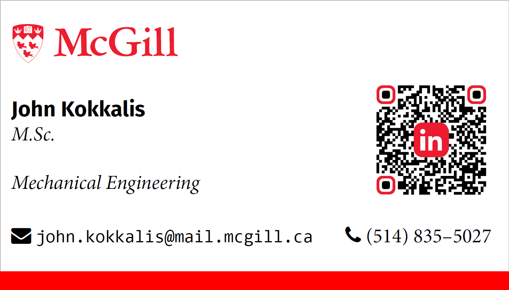

# LaTeX Business Card

A simple template for a business card with LaTeX. This setup creates one card (rather than a grid of cards on letter paper), for submission to professional printing service. 

Paper size is of common dimension (at least in the US?) but is customizable, as is the margin size.

The QR code used in the card is generated by [https://qr.io/](https://qr.io/).

## About svg

The QR code is a `.svg` which requires the svg package and [inkscape](https://inkscape.org/release/inkscape-1.2.2/) to be installed and added to your `PATH` variables. Be sure to check the "add to system path" option during installation of inkscape. 

Alternatively, you could manually convert the `.svg` to `.pdf` or `.png` and use the `\includegraphics` command without needing inkscape or the svg package.

## About fonts

This document uses the FontAwesome package for little image icons. I set up the document with XeLaTeX although you can repurpose it for PdfLaTeX. In case the FontAwesome package is not available see [here](https://tex.stackexchange.com/questions/132888/fontawesome-font-not-found) or [here](https://stackoverflow.com/questions/30677698/xelatex-fontawesome).

This document happens to use Minion Pro, which is pretty but proprietary and downloaded from [Adobe Fonts](https://fonts.adobe.com/fonts/minion). It also uses the Consolas font for monospaced typesetting which is proprietary and owned by Microsoft. Be careful with commercial use.

You can simply swap out the Minion Pro `.otf` and the `consola.ttf` files in the [fonts](./fonts) folder with any other font files that you like. Learn about easy-to-use LaTeX typefaces [here](https://tug.org/FontCatalogue/).

# Other Business Card Templates

I borrowed a lot of this card design from [mikedecr](https://mikedecr.netlify.app/). Checkout his website and other repos, they're awesome.
